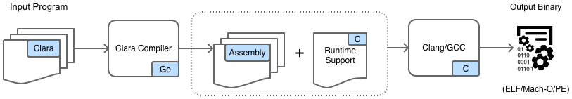

# Introduction

Clara is a statically typed, general purpose, natively compiled language in the spirit of
[Go](https://golang.org/) which aims to be fun & clear.

For an idea of where it _might_ be going, see the [What's Next](#whats-next) section.

## Getting Started

To get Clara running on your machine you'll need the following available on your `$PATH`:

 * Go including `$GOPATH/bin`
 * GCC or Clang

Then if you are on Linux or Mac simply run the following:

<pre>
<code class="language-bash">git clone https://github.com/g-dx/clara/
cd clara
./build-and-run hello.clara</code>
</pre>

This will build the compiler, run all tests, prepare the standard library, compile the _./install/examples/hello.clara_ program 
and run it. All being well you should see the familiar "Hello World!" message in your console.

## Architecture

The following diagram shows how the Clara compiler & GCC/Clang work together to produce platform native binaries.

Currently only OSX & Linux are supported but Windows is hopefully coming soon!  

# Overview

## Influences

Clara's heritage is mixed but can largely be traced to the following languages:

 * Go - the compiler implementation language.
 * [Koka](https://koka-lang.github.io/koka/doc/kokaspec.html) - a _function orientated_ language from Microsoft Research 
 which _infers_ side-effects.
 * Java - the first programming language I worked with. 
 * [Kotlin](https://kotlinlang.org/) - the reason Clara has had no `null`  value from the start.

## Hello World 
As usual we start with the obligatory _hello world_ program:
<pre>
<code class="language-clara">fn main() {
    "Hello World!".println()
}</code>
</pre>

## Values

Clara contains the following _built-in_ types which will be familiar to most users.

 * `bool` - with two possible literal values, `true` & `false`
 * `int` - a signed, 63-bit integer defined using decimal or hexadecimal notation
 * `string` - a block of memory holding a contiguous series of bytes which represent _text_
 * `bytes` - a block of memory holding a contiguous series of bytes.

<pre>
<code class="language-clara">// Bool
true
false

// Integer
100
-2
0xFF

// String
"Hello!"

// Bytes
Bytes(10)</code>
</pre>

### Variables

Clara contains two statements for working with variables; declaration & assignment `:=` & 
assignment `=`

<pre>
<code class="language-clara">// Declare a new variable 'x' in the current lexical scope and 
// assign it the integer value 100
x := 100 

// Assign variable 'x' the integer value 1000
x = 1000

// Compiler error as 'x' cannot be redeclared!
x := 10000</code>
</pre>

In Clara there is no way to construct an uninitialised variable.

### Arrays

Clara also has some _array_ variants of the built-in types with support for _array literals_.

<pre>
<code class="language-clara">ints := intArray(2)
ints[0] = 1
ints[1] = 2
ints = [0, 1, 2, 3, 4, 5, 6, 7, 8, 9]

strings := stringArray(2)
strings = "Hello"
strings = "World!"
strings = ["Hello", "World"]</code>
</pre>

## Control Flow

Clara supports a 2 control flow constructs; `while` & `for`. 

<pre>
<code class="language-clara">vals := [1, 2, 3, 4, 5, 6, 7, 8, 9]
i := 0
while i < vals.length {
   vals[i].println()
   i = i + 1
}</code>
</pre>

A safer way to write the above loop is to use the `for` statement:

<pre>
<code class="language-clara">for val in [1, 2, 3, 4, 5, 6, 7, 8, 9] {
   val.println()
}</code>
</pre>
(The compiler actually lowers all `for` statements to `while` statements)

Another way to write the above loop is using the `for .. in` statement which supports _integer ranges_

<pre>
<code class="language-clara">for val in 0 .. 10 {
   val.println()
}</code>
</pre>

When the range is _increasing_ the beginning is _inclusive_ and the end is _exclusive_. These are 
flipped when the range is _decreasing_.

## Functions

Clara maintains a clean separation between code & data. This means there is no way to couple a function to 
any data other than its inputs or output. 

Function declarations are fairly straightforward. The following computes the fibonacci sequence: 

<pre>
<code class="language-clara">fn fib(n: int) int {
     if n < 2 {
         return n
     }
     return fib(n - 1) + fib(n - 2)
 }</code>
</pre>

The `fib` function accepts a single parameter `n` of type `int` & returns an `int`. 

Functions which do not return anything are said to return `nothing` and declaring the return type is optional:

<pre>
<code class="language-clara">fn hello(msg: string) {
    "Hello message is: ".append(msg).println()
}</code>
</pre>

Functions which return the result of a single _expression_ may use the _function expression_ syntax and omit the return 
keyword & curly braces:

<pre>
<code class="language-clara">fn isEven(x: int) bool = x.mod(2) == 0</code>
</pre>

#### Dot Selection 

Functions can be invoked in the normal way by passing all required arguments but may also be invoked using 
"dot selection" notation. The following example illustrates this:

<pre>
<code class="language-clara">fn main() {
    add(2, 3)
    2.add(3)  // Equivalent to the line above 
}

fn add(x: int, y: int) int = x + y</code>
</pre>

Here it important to note that the second `add` function call is simply "syntactic sugar" for the 
first `add` call. These are functionally equivalent. This allows for easy function chaining & also "extending" foreign 
types by simply writing a new function which takes that type as its first argument:

<pre>
<code class="language-clara">fn main() {
    "Clara!".emphasize().println()
}

fn emphasize(s: string) string = "** ".append(s).append(" **")</code>
</pre> 

#### First Class Functions

Functions in Clara are also said to be "first class" in that they can be passed as arguments to other functions, 
returned as values from functions & assigned to local variables or stored in data structures.

<pre>
<code class="language-clara">fn main() {
    msg := "Down with this sort of thing. Careful now!"

    style := italic
    style.applyTo(msg).println()

    style = [bold, italic].compose()
    style.applyTo(msg).println()
}

fn applyTo(f: fn(string) string, s: string) string = f(s)
fn bold(s: string) string = "**".append(s).append("**")
fn italic(s: string) string = "_".append(s).append("_")

fn compose(styles: []fn(string) string) fn(string) string {
    return fn(msg: string) string {
        for style in styles {
            msg = msg.style()
        }
        return msg
    }
}</code>
</pre> 
 
Clara also supports both anonymous functions and closures: 

<pre>
<code class="language-clara">fn main() {
    square := fn(x: int) int = x * x
    "6² = ".append(square(6).toString()).println()

    next := intStream(0)
    next().println() // 1
    next().println() // 2
    next().println() // 3
    next().println() // 4 ... etc
}

fn intStream(x: int) fn() int {
    return fn() int {
        x = x + 1
        return x
    }
}</code>
</pre>
 
## Structs

Structs represent a _composite data type_ over other types, including other structs. Here is an example of a `employee` 
struct:
<pre>
<code class="language-clara">struct employee {
    name: string
    age: int
    department: string
    active: bool
}

fn main() {
    e := Employee("Clark Kent", 35, "Journalism", true)
}</code>
</pre>

The compiler automatically generates a _constructor_ function for all `struct`s using a capitalised version
of the struct name. This has the requirement that all `struct` names *must* begin with a lowercase letter.

## Enums

Enums, also called tagged unions, variants or sum types, are a data type which may hold one of a fixed list of possible 
values.

<pre>
<code class="language-clara">enum food {
    Pizza(kind: string, inches: int)
    Soup(vegetables: []string, containsMeat: bool)
}

fn main() {
    f := Pizza("Pepperoni", "12")
    f := Soup(["pea", "mint", "courgette"], false)
}</code>
</pre>

// TODO: Expand this further

## Generics

Structs, enums & functions also support _parameter types_ or parameterisation of the _type_ of 
their parameters or fields.

<pre>
<code class="language-clara">struct box«T» {
  val: T
}

fn main() {
  intBox := Box(1)      // box«int»
  boolBox := Box(false) // box«bool»
  intBox = boolBox      // Compiler error!
}</code>
</pre>

// TODO: Expand this further

## Functional Programming

Clara contains a small standard library with support for the following functional types:

 * [option«T»](https://github.com/g-dx/clara/blob/d81debd436723a811298ec3d9d43900c6f99ff06/install/lib/functional.clara#L1-L4)
 * [result«T, E»](https://github.com/g-dx/clara/blob/d81debd436723a811298ec3d9d43900c6f99ff06/install/lib/functional.clara#L54-L57)
 * [either«L, R»](https://github.com/g-dx/clara/blob/d81debd436723a811298ec3d9d43900c6f99ff06/install/lib/functional.clara#L89-L92)
 * [pair«T, R»](https://github.com/g-dx/clara/blob/d81debd436723a811298ec3d9d43900c6f99ff06/install/lib/functional.clara#L47-L50)
 * [list«T»](https://github.com/g-dx/clara/blob/d81debd436723a811298ec3d9d43900c6f99ff06/install/lib/list.clara#L1-L4)
 * [map«K, V»](https://github.com/g-dx/clara/blob/d81debd436723a811298ec3d9d43900c6f99ff06/install/lib/map.clara#L1-L7)

The standard operators such as `map`, `filter`, `then`, `peek`, etc are supported.

## Garbage Collection

Clara contains a a _precise_, _non-moving_, _incremental_ mark & sweep garbage collector built on top of the 
[Tag-Free Garbage Collection](https://cs.nyu.edu/goldberg/pubs/gold91.pdf) scheme. This approach is interesting in that 
the pointer information gathered during compilation is used to generate _program specific_ garbage collection routines 
such that no interpretation of memory locations at runtime is required. In this sense every program contains a 
_completely bespoke_ garbage collector.  

For a thorough explanation see the linked paper.

# What's Next 

The following is a list, in no particular order, of features which are slated for inclusion in the language.

 * Modules
 * Nullable Types
 * Default Arguments
 * ToString() & Equals()
 * Interpolated Strings 

Icons made by <a href="http://www.freepik.com" title="Freepik">Freepik</a> from <a href="https://www.flaticon.com/" title="Flaticon">www.flaticon.com</a> is licensed by <a href="http://creativecommons.org/licenses/by/3.0/" title="Creative Commons BY 3.0" target="_blank">CC 3.0 BY</a>
